# HealthCare Platform - Authentication Sequence Diagrams
## 
Sequence Diagram: Đăng ký và đăng nhập.
-	Mục tiêu: Người dùng đăng ký hoặc đăng nhập vào hệ thống để sử dụng các chức năng.
-	Các bước:
•	Người dùng truy cập vào trang đăng ký/đăng nhập.
•	Nhập thông tin (email, mật khẩu; nếu đăng ký bổ sung họ tên, vai trò; nếu là Bác sĩ, điền chuyên khoa, kinh nghiệm, phí, khoa).
-	Hệ thống kiểm tra thông tin hợp lệ:
•	Nếu đăng ký thành công: Hash mật khẩu và lưu người dùng vào CSDL; nếu vai trò là Bác sĩ, tạo hồ sơ bác sĩ ở trạng thái chờ được chấp nhận; tạo thông báo chào mừng và quay về trang đăng nhập.
•	Nếu đăng nhập thành công: Chuyển hướng đến giao diện chính.
-	Trường hợp lỗi: Dữ liệu không hợp lệ hoặc thông tin sai → trả 400 và hiển thị thông báo lỗi.

## Sign Up (Registration) Flow

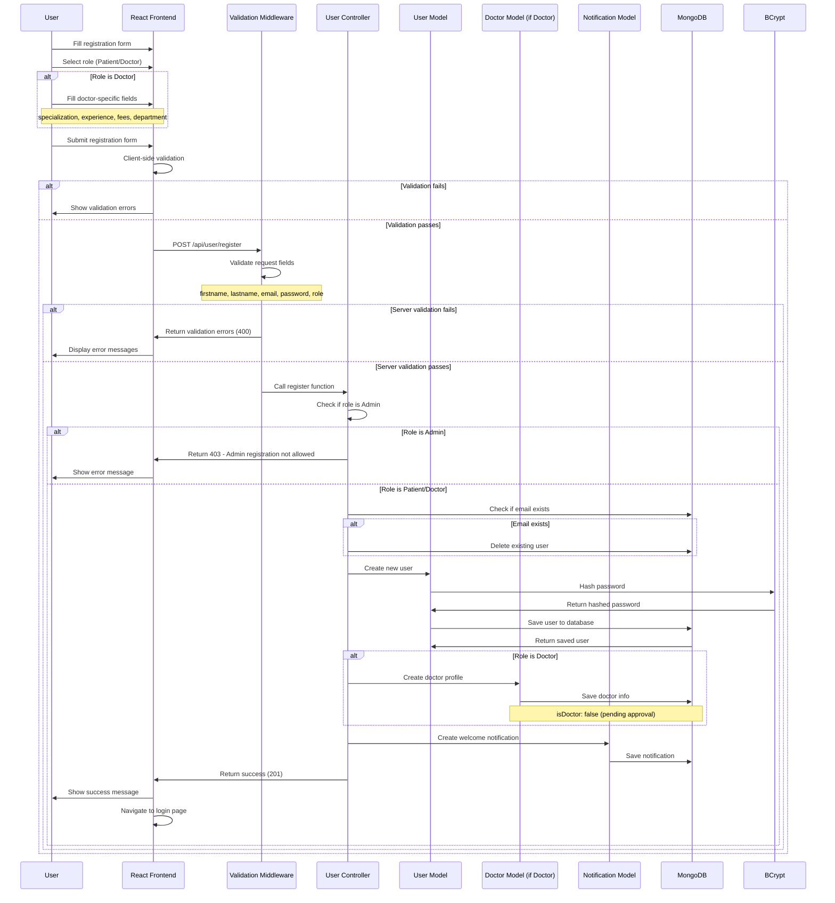

## Shift Management – Diagrams

## Sequence Diagram: Quản lý ca làm (Shift Management).
-	Mục tiêu: Quản lý ca làm của bác sĩ: bác sĩ gửi yêu cầu ca (chờ duyệt), Admin có thể tạo ca trực tiếp, duyệt/từ chối yêu cầu, và bác sĩ có thể chặn/mở slot đặt lịch.
-	Các bước:
•	Bác sĩ mở trang “Schedule”, chọn nút "Create Shift", điền tiêu đề, bác sĩ có thể chọn sẵn các Preset có sẵn để tự động điền khung giờ, thời lượng slot, thời gian nghỉ rồi chọn ngày trong tuần sau đó gửi yêu cầu tạo ca.
•	Hệ thống kiểm tra tính hợp lệ (tiêu đề/giờ/ngày…). Nếu hợp lệ, tạo ca với trạng thái “Chờ duyệt (pending)” và gửi thông báo cho bác sĩ.
•	Admin mở mục “Shift Requests” để xem danh sách, Phê duyệt/Từ chối. Khi Phê duyệt, ca xuất hiện trong lịch tuần; khi Từ chối, hệ thống lưu lý do (nếu có) và thông báo cho bác sĩ.
•	Admin cũng có thể tạo ca trực tiếp cho một bác sĩ; ca này xuất hiện ngay trong lịch tuần (không qua bước chờ duyệt).
•	Bác sĩ có thể chặn/mở một slot cụ thể (kèm lý do) để tạm ngừng/cho phép nhận bệnh nhân ở khung giờ đó.
-	Trường hợp lỗi:
•	Người dùng không phải Bác sĩ gửi yêu cầu tạo ca → 403.
•	Dữ liệu không hợp lệ (thiếu hoặc sai định dạng tiêu đề/giờ/ngày) → 400.
•	Admin tạo ca cho bác sĩ không tồn tại → 404.
•	Chặn/Mở slot không thuộc quyền của bác sĩ hiện tại hoặc không tồn tại → 404.

### Create Shift → Admin Approval → Slot Management
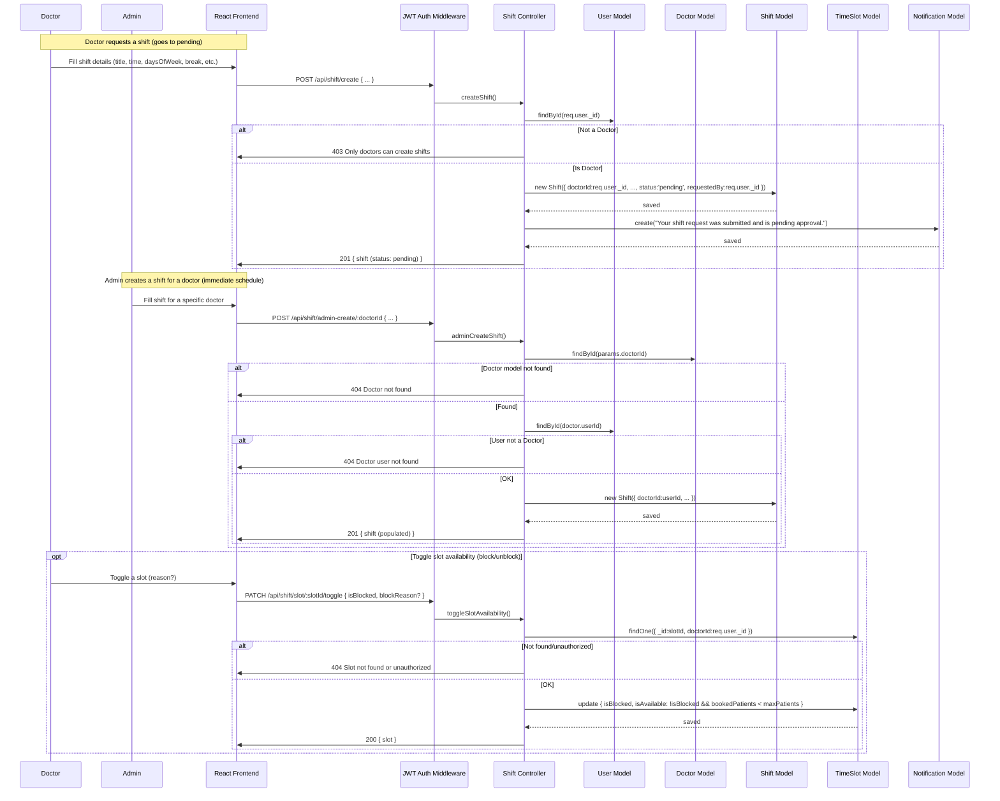

### Leave Request → Approval/Coverage

## 
Sequence Diagram: Xin nghỉ phép (Leave) và phân công người trực thay.
-	Mục tiêu: Cho phép bác sĩ xin nghỉ (đính kèm minh chứng), hệ thống chặn slot trong thời gian nghỉ và phân công đồng nghiệp trực thay (nếu có).
-	Các bước:
•	Bác sĩ điền loại nghỉ, khoảng thời gian, lý do, đánh dấu khẩn cấp (nếu có), và đề xuất đồng nghiệp có thể trực thay; tải kèm file chứng từ.
•	Hệ thống kiểm tra trùng lặp thời gian nghỉ đang chờ duyệt/đã duyệt, yêu cầu đề xuất người trực thay nếu không khẩn cấp; tạo yêu cầu nghỉ và thông báo cho Admin/đồng nghiệp.
•	Admin duyệt/Từ chối: Khi Duyệt, hệ thống chặn toàn bộ slot của bác sĩ trong khoảng nghỉ; nếu đã có đồng nghiệp chấp nhận trực thay, tự động tạo slot cho người đó theo cấu trúc ca sẵn có; gửi thông báo.
-	Trường hợp lỗi: Dữ liệu không hợp lệ → 400; Không có quyền hoặc yêu cầu đã xử lý → 403/400; Không tìm thấy yêu cầu → 404.

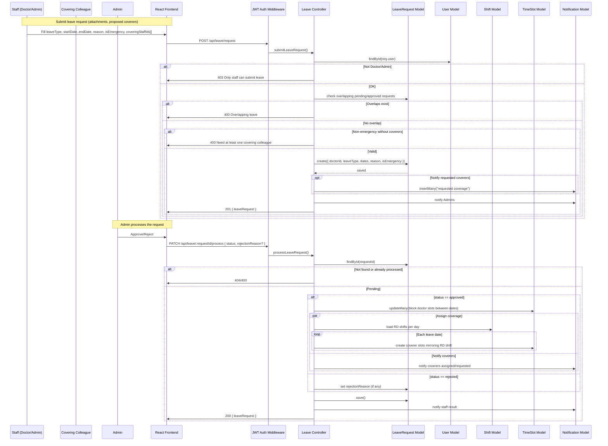

### Overtime Request → Approval

## 
Sequence Diagram: Xin tăng ca (Overtime) sau giờ làm.
-	Mục tiêu: Bác sĩ đề xuất tăng ca thêm giờ sau ca hiện tại để nhận thêm bệnh nhân, chờ Admin duyệt.
-	Các bước:
•	Bác sĩ chọn ca, ngày và số giờ muốn tăng ca, nêu lý do; hệ thống tạo yêu cầu và thông báo.
•	Admin duyệt/Từ chối: Khi Duyệt, hệ thống sinh các slot bổ sung ngay sau giờ kết thúc ca trong giới hạn số giờ tăng ca; gửi thông báo kết quả.
-	Trường hợp lỗi: Thiếu trường bắt buộc → 400; Không tìm thấy yêu cầu → 404; Không có quyền (không phải Admin) → 403.

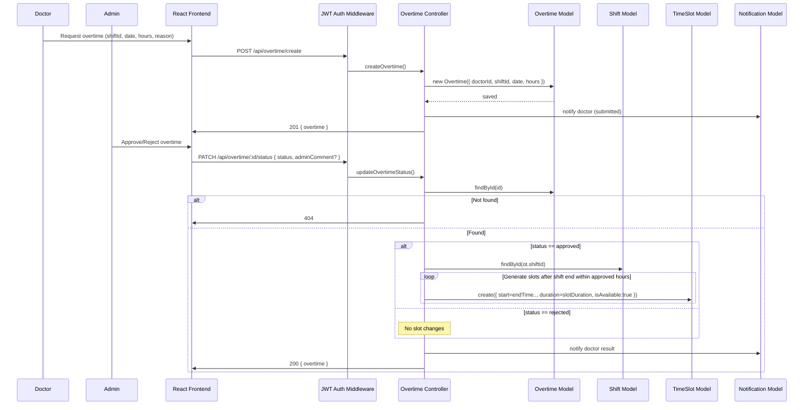

### Shift Swap → Partner Respond → Admin Approval

## 
Sequence Diagram: Đổi ca làm (Shift Swap) với đồng nghiệp.
-	Mục tiêu: Bác sĩ đề xuất đổi ca (trao đổi hai chiều hoặc nhờ đồng nghiệp trực giúp), đồng nghiệp phản hồi, Admin phê duyệt.
-	Các bước:
•	Bác sĩ A tạo yêu cầu đổi ca: chọn ca gốc, đồng nghiệp B, kiểu đổi (trade/cover), chọn ngày hoặc khoảng ngày; hệ thống kiểm tra quyền sở hữu ca, tương thích chuyên khoa/khoa, xung đột thời gian.
•	Đồng nghiệp B phản hồi Chấp nhận/Từ chối. Khi B đã chấp nhận, Admin có thể Duyệt: hệ thống đảm bảo có slot cho ngày liên quan, chuyển quyền các slot ca gốc sang B; với trade, nếu ca yêu cầu của B có đúng ngày trong tuần thì chuyển slot ngược lại cho A; cập nhật phân công nếu trùng nghỉ đã duyệt.
-	Trường hợp lỗi: Dữ liệu/điều kiện không hợp lệ → 400; Chưa có phản hồi của đối tác nhưng yêu cầu duyệt → 400; Không có quyền/không tìm thấy yêu cầu → 403/404.

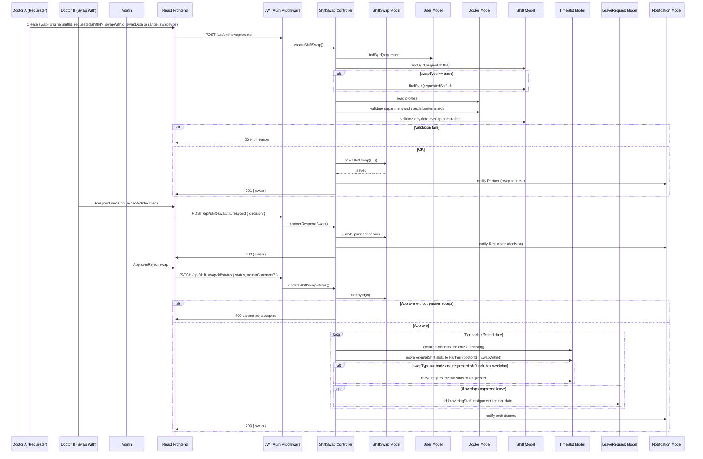

## 
Sequence Diagram: Tạo Hồ sơ bệnh án đi kèm với Đơn thuốc và Số liệu sức khỏe.
-	Mục tiêu: Bác sĩ tạo Hồ sơ bệnh án cho lịch hẹn đã hoàn thành.
-	Các bước:
•	Bác sĩ đi tới trang “Medical Record” để xem những cuộc hẹn đã hoàn thành và sau đó bấm vào nút “Create Record”.
•	Bác sĩ điền các thông tin cần thiết cho hồ sơ bệnh án của bệnh nhân, với những mục không cần thiết bác sĩ có thể chọn nút “Skip” để lược bỏ phần đó khỏi hồ sơ bệnh án.
•	Với mỗi hồ sơ bệnh án có thể đính kèm từ 1 đến nhiều đơn thuốc, bác sĩ có thể kê thêm đơn phụ thuộc vào tình hình của bệnh nhân. Với Số liệu sức khỏe bác sĩ có thể phụ thuộc vào các số liệu khám của bệnh nhân mà điền vào.
•	Sau khi hoàn thành bước điền, bác sĩ bấm vào nút “Create Medical Record” để tạo Hồ sơ bệnh án hoàn chỉnh cho bệnh nhân.

## Medical Record - Create Flow
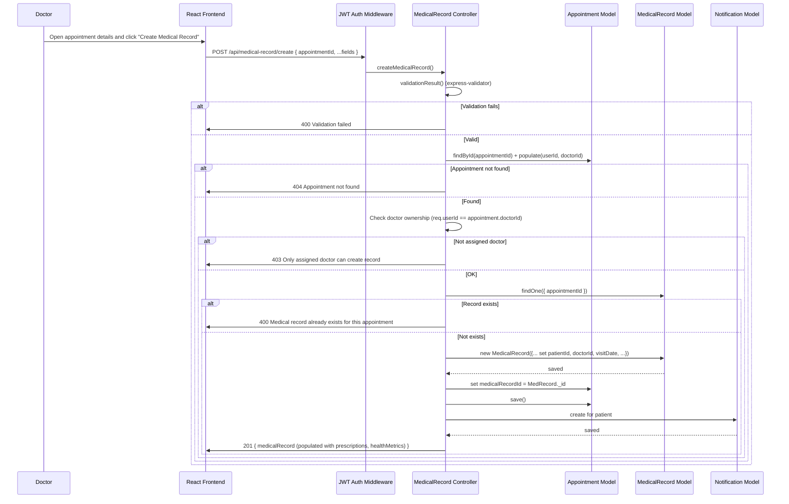

## Prescription - Add to Record Flow
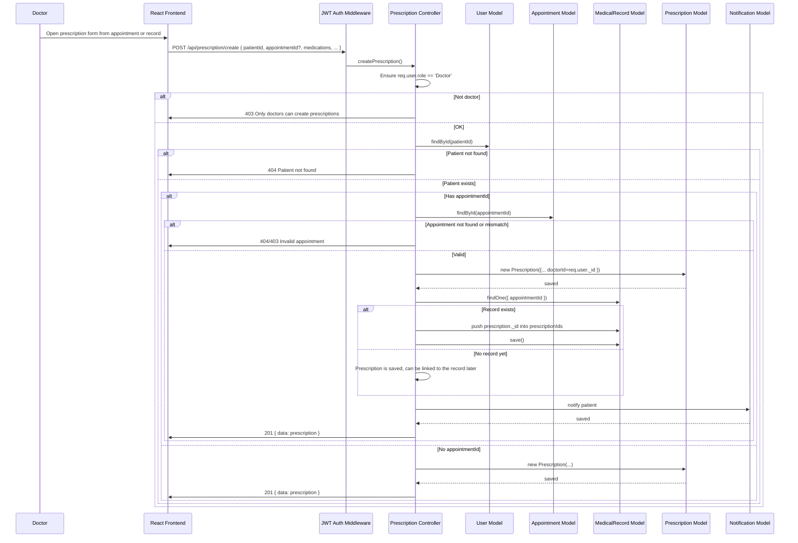

## Health Metrics - Record and Link Flow
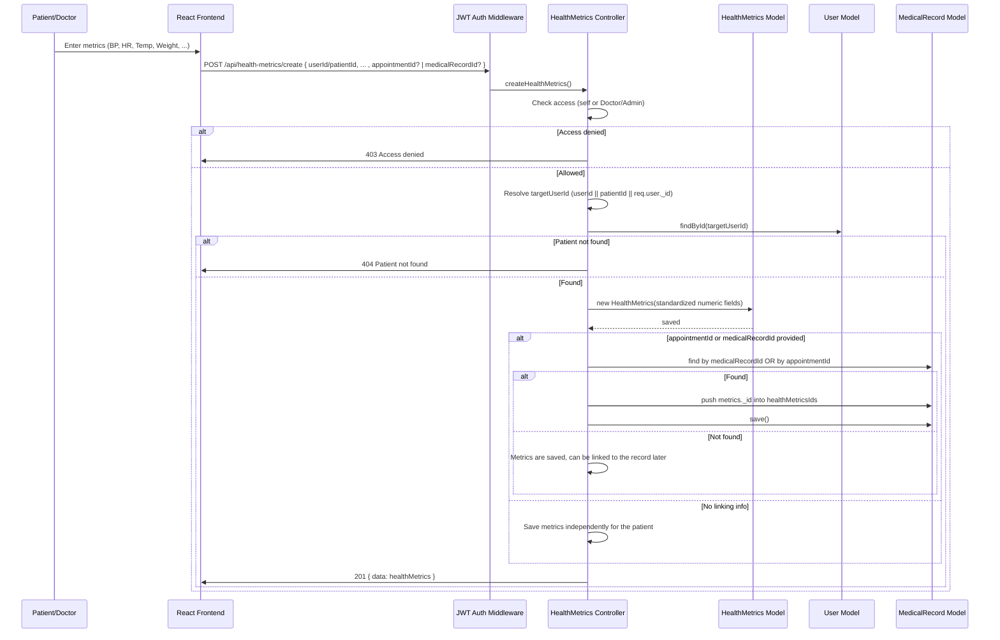

##
Sequence Diagram: Nhắn tin.
-	Mục tiêu: Người dùng gửi và nhận tin nhắn trong phòng chat (theo lịch hẹn hoặc chat trực tiếp).
-	Các bước:
•	Mở giao diện chat.
•	Nếu chưa có phòng chat, hệ thống tạo phòng (theo lịch hẹn hoặc chat trực tiếp giữa hai người).
•	Gõ nội dung và bấm Gửi; người nhận sẽ thấy tin nhắn ngay trên màn hình.
•	Khi người nhận mở chat, tin nhắn sẽ được đánh dấu là đã đọc và số tin chưa đọc trở về 0.

## Chat Message Flow

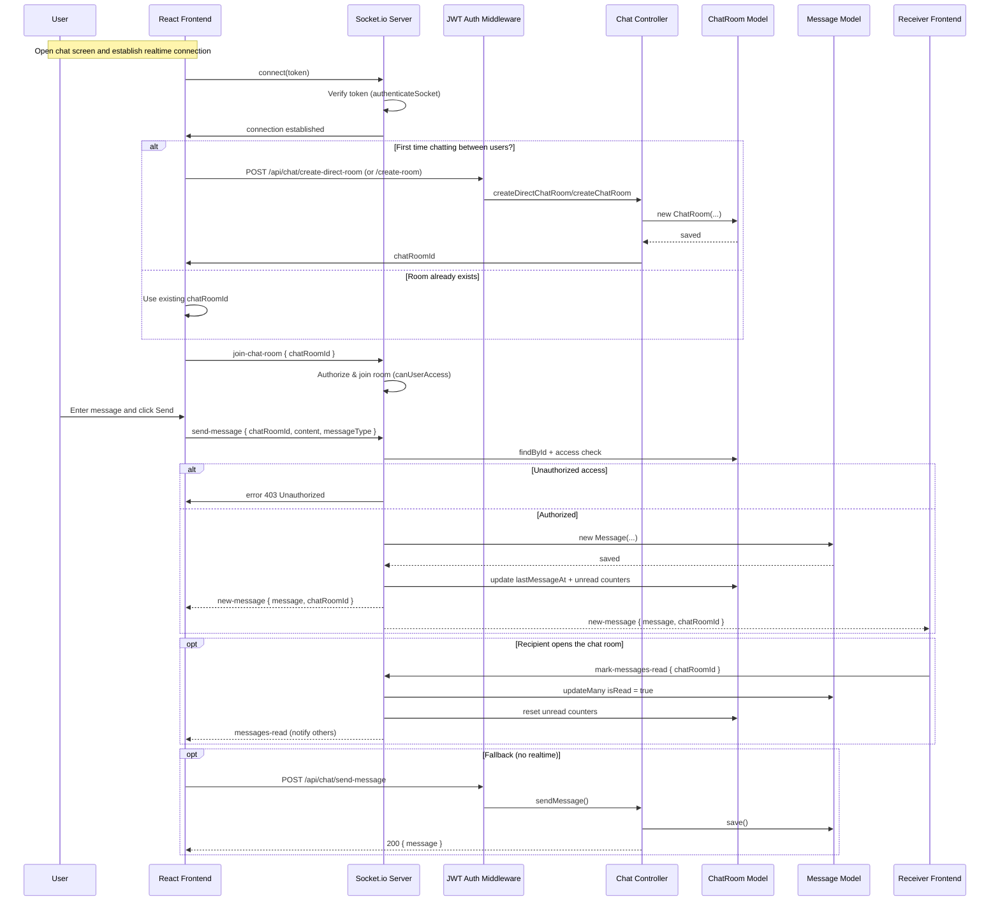

## Sign In (Login) Flow

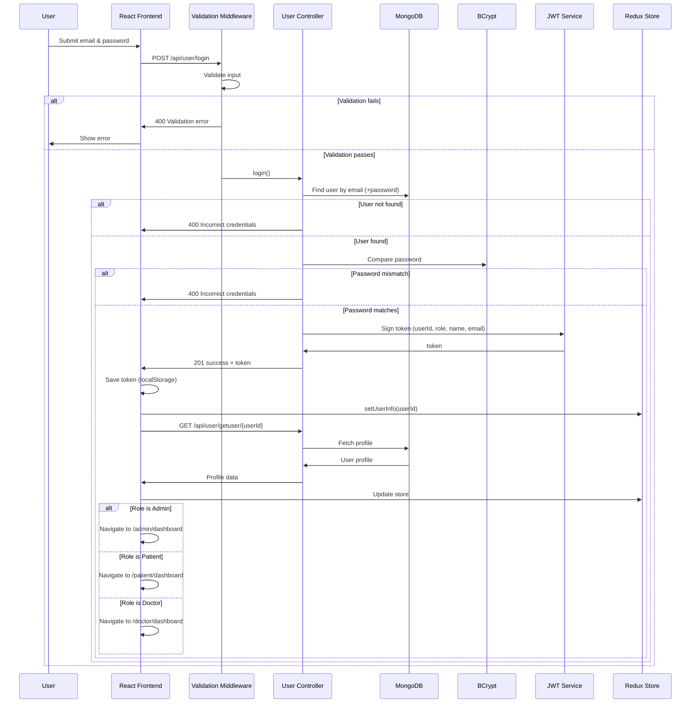

##
Sequence Diagram: Đặt lịch hẹn khám bệnh.
-	Mục tiêu: Cho phép bệnh nhân đặt lịch hẹn với bác sĩ và tạo bản ghi thanh toán, thông báo liên quan.
-	Các bước:
•	Bệnh nhân di chuyển tới trang tìm bác sĩ và dùng thanh tìm kiếm hoặc bộ lọc (chuyên khoa, kinh nghiệm, phí, thời gian làm việc) để tìm người phù hợp sau đó nhấn nút “Book Appointment” ở hồ sơ bác sĩ bạn muốn đặt.
•	Bệnh nhân sau đó chọn ngày, giờ, và lý do khám và đi tới bước thanh toán.
•	Bệnh nhân điền chi tiết thẻ ngân hàng để tiến hành thanh toán.
•	Khi thanh toán thành công, hệ thống tạo lịch hẹn và gửi thông báo xác nhận. Bệnh nhân sẽ nhận được thông báo trong hệ thống. Bác sĩ cũng nhận thông báo về lịch hẹn của bệnh nhân. 
•	Sau khi đặt lịch bệnh nhân có thể xem chi tiết ở trang “My Appointments”.

## Book Appointment Flow

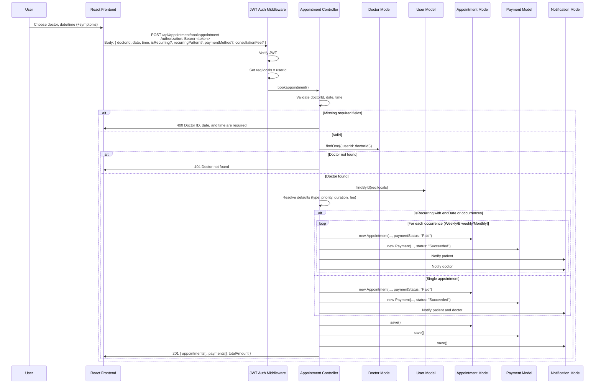